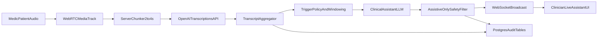

# Live Clinical Feedback Pilot Plan

## Goal

Enable clinicians to receive low-latency, assistive-only prompts during consultations (questions to ask, guideline reminders, possible risk flags), without interrupting workflow or taking autonomous clinical actions.

## Architecture Decision

Start with **chunked transcription first** (your selected approach), then add realtime transcription as a Phase 2 upgrade.

- **Phase 1 (pilot):** send audio chunks every 2-4s to `/v1/audio/transcriptions`, aggregate transcript, run rule + LLM assistance, push suggestions over existing WebSocket.
- **Phase 2:** switch primary transcription path to Realtime transcription session over WebSocket for lower latency and better turn handling, keep chunked path as fallback.

## Proposed Monorepo Changes

- Backend ingestion and orchestration in `[server/](server/)`:
  - Add consultation-scoped `LiveTranscriptionSession` service (buffer, chunking, retries, ordering, dedup).
  - Add `LiveAssistOrchestrator` service (windowing, trigger policy, cooldowns, confidence thresholds).
  - Add `ClinicalSafetyPolicy` module for assistive-only constraints and prohibited wording.
- Shared contracts in `[shared/](shared/)`:
  - Add typed events for `live_transcript_delta`, `live_assist_suggestion`, `live_assist_warning`, `live_assist_status`.
  - Add suggestion payload schema with `consultationId`, `timestamp`, `category`, `confidence`, `sourceSnippet`, `recommendation`.
- Frontend clinician UI in `[client/](client/)`:
  - Add non-blocking “Live Assistant” panel (or popovers) with debounced updates and dismiss/ack controls.
  - Add websocket event handlers and React Query cache integration for live suggestions timeline.

## Data Flow

## Trigger Strategy (Phase 1)

Use a hybrid trigger policy to control cost and noise:

- **Time trigger:** evaluate every 6-10 seconds on rolling transcript window.
- **Semantic trigger:** immediate run when keywords/phrases indicate symptoms, dosage, contraindications, allergies, pregnancy, pediatric/geriatric concerns, or emergency cues.
- **Stability trigger:** require minimal transcript confidence and punctuation boundary (or VAD-like pause) before generating recommendation.
- **Cooldown:** suppress repeated near-duplicate suggestions for 30-60 seconds.

## Model and API Strategy

- **Transcription:** `gpt-4o-mini-transcribe` for pilot latency/cost balance; stream events where useful for completed chunks.
- **Assistant generation:** `gpt-4o` (or your current clinical assistant model) with strict assistive prompt:
  - propose follow-up questions
  - raise cautionary flags with uncertainty phrasing
  - never provide definitive diagnosis/action language
- **Fallbacks:** on transcription/API failure, keep consultation running, show degraded-mode status, and continue post-consultation pipeline.

## Safety and Compliance Guardrails (Assistive-Only)

- Enforce output policy template: “Consider asking…”, “Potential concern to verify…”, “Check guideline for…”.
- Block hard directives (e.g., absolute medication orders) at post-generation validation layer.
- Log all suggestions + source snippets + model/version metadata for auditability.
- Keep clinician in control: dismiss, snooze category, and acknowledge actions in UI.

## Observability and Pilot Metrics

Add metrics and dashboards for:

- latency (audio chunk end -> suggestion displayed)
- suggestion precision proxy (dismiss rate, clinician acknowledgment rate)
- duplicate alert rate
- API error rate + fallback frequency
- cost per consultation minute

## Rollout Plan

1. Internal dogfooding with synthetic consultations and scripted edge cases.
2. Limited pilot with selected clinicians and feature flag at consultation level.
3. Weekly prompt/policy tuning based on false positives and missed opportunities.
4. Decide promotion criteria for Phase 2 realtime migration.

## Testing Plan

- Unit tests for chunk ordering, dedup, cooldown, and policy filters.
- Integration tests for end-to-end websocket event delivery to clinician UI.
- Simulation set covering allergy mentions, dosage ambiguity, contraindication hints, and benign small talk.
- Load test with concurrent consultations to validate Replit single-node limits.

## Phase 2 Upgrade Path (Realtime)

When pilot is stable, migrate primary transcription to OpenAI Realtime transcription sessions (`intent=transcription`) to reduce end-to-end delay while reusing the same trigger, safety, and UI layers.

Reference docs used:

- [OpenAI Speech-to-Text streaming guide](https://developers.openai.com/api/docs/guides/speech-to-text#streaming)
- [LangChain streaming modes](https://docs.langchain.com/oss/javascript/langchain/streaming)

